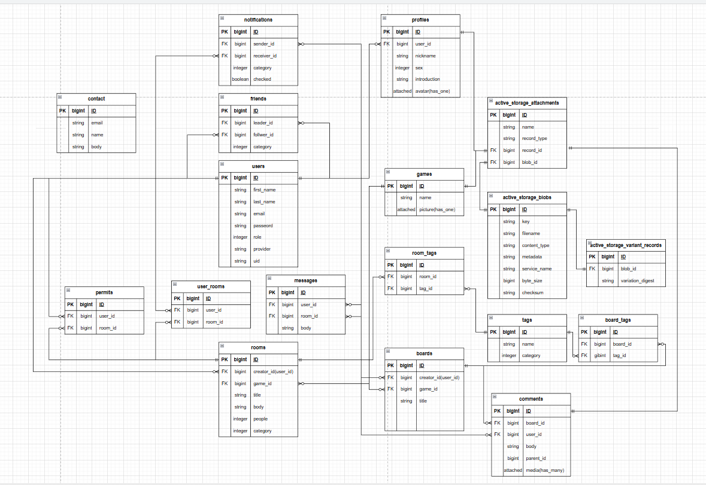

## Gamers-room

 

このアプリは気軽にゲームのリアルタイムパーティー募集や掲示板での情報交換や議論が出来る
ユーザー同士の交流のためのサービスです。

## サービスのURL
一部機能は新規登録が必要になります。 
https://gamers-room.net/

## このサービスへの思い、作りたい理由
自分は誰かと一緒にパーティーを組んで通話しながらゲームをすることが好きです。 
複数人友人を集めるのはできない時があるためネットのパーティー募集などを見ても、
パーティーを組むところから、ボイスチャットに移るまでの手間が時間がかかって億劫だったので、
もっと気軽にパーティー募集をしたいという思いからこのアプリを作成しました。 
また、ゲームの情報や議論を通してゲームの上達につながるような掲示板機能も実装し、ゲーマーの交流のためのプラットフォーム
を目指しています。

## サービス利用のイメージ
まず参加したいユーザーはパーティー募集の一覧から募集に参加申請できます。募集の作成者から承認されることでその募集に参加できるようになります。
リアルタイムの募集なので、その募集に集まった人たちとすぐにゲームをすることが出来ます。
また、ボイスチャットをするためのdiscordサーバーが用意してあります。
掲示板では、ゲームの情報交換、議論、ゲームのフレンド募集などが出来ます。

## ユーザー層について
* 大学生から社会人のゲーマー 
  PCでゲームをする割合が20~40代が多いため。
* 誰かとゲームをするのが好きな人 
  ゲームのパーティー募集がメイン機能としてあるため。

## 機能一覧
### ユーザー機能

| ログイン・ユーザー登録 | プロフィール |
| ---- | ---- |
|  |  |
| メールアドレスとパスワードによるログインまたは、Google認証によるログインが出来ます。 パスワードリセットのメールも送信できます。 | アカウント登録するとプロフィール設定画面に遷移します。ニックネーム、性別、アバターの設定が出来ます。プロフィール画面で編集が出来ます。 |
|  |  |

| 設定画面 | お問い合わせ |
| ---- | ---- |
|  |  |
| ユーザー情報の確認と編集が出来ます。利用規約等の画面への遷移が出来ます | アプリに関する問い合わせが出来ます。 お問い合わせが作成されると管理者へメールが送信されます。 |
|  |  |

### パーティー募集機能
| 募集作成 | 参加申請 |
| ---- | ---- |
|  |  |
| パーティー募集の作成。タイトル、ゲームタイトル、人数、タグ、詳細の設定が出来ます。 募集が作成されると、Discordのサーバーへ通知が飛びます。 1時間ごとにバックグラウンドジョブにより作成されてから24時間たった募集は自動で削除されます。 | 募集の詳細画面から参加申請が出来ます。申請が承認されると、その募集に参加できます。 |
|  |  |

| チャットページ | メッセージ機能 |
| ---- | ----|
|  |  |
| 参加申請があると、非同期で申請者欄に表示されます。 申請の承認とユーザーのキック機能は募集の作成者のみ出来ます。| 参加者はこのページで非同期にによるメッセージの送信を行うことが出来ます。 |
|  |  |

### 掲示板機能
| 掲示板作成 | コメント機能 |
| ---- | ---- |
|  |  |
| 掲示板の作成。タイトル、ゲームタイトル、タグの設定が出来ます。 | コメントが出来ます。画像を添付することもできます。 画像はモーダルで表示されます。コメントに対して返信をすることが出来ます 。|
|  |  |

### フレンド機能
| フレンド申請 | フレンドチャット |
| ---- | ---- |
|  |  |
| 他のユーザーにフレンド申請が出来ます。承認されるとフレンドになります。 ブロック機能があり、ブロックしたユーザーはフレンド一覧に表示されなくなり、通知も届かなくなります。 | フレンドとの個人チャットです。 |
|  |  |

### 通知機能
| 通知の受信 |
| ---- |
|  | 
| フレンド申請、フレンド申請の承認、パーティー募集の申請承認の通知を受信します。 ヘッダーの通知数は非同期で更新されます。 |
|  |

### 検索機能
| 募集検索 | 掲示板検索 |
| ---- | ---- |
|  |  |
| 検索フォームでの検索、カードのゲームタイトル、タグでの検索が出来ます。 |
|  |  |

### 管理画面機能
管理画面はロールがadminのユーザーのみアクセスできます  
| ユーザー管理 | 募集・掲示板の管理 |
| ---- | ---- |
|  |  |
| ユーザー詳細から、ユーザー情報、プロフィールの編集、削除が出来ます。 | 募集、掲示板ともに詳細から編集、削除が出来ます。また、メッセージとコメントを確認でき削除が出来ます。 |

|  |  |

| ゲームタイトル・タグの管理 | お問い合わせの管理 |
| ---- | ---- |
|  |  |
| ゲームタイトルとタグの追加と削除が出来ます。 | お問い合わせの確認が出来ます。 |
|  |  |

 

### SEO対策
* meta-tagsの設定
* robot.txtとサイトマップの作成

 

## 使用した技術
| カテゴリー | 技術・ツール |
| --------- | --------------------------- |
| バックエンド | Ruby on Rails 7.2.2 |
| フロントエンド | Javascript / Hotwire |
| フロントビルド | Node.js / yarn / esbuild( jsbundling-rails ) / sass( cssbundling-rails ) |
| css | Bootstrap5 |
| データベース | PostgreSQL |
| 認証 | Devise / OmniAuth( Google Oauth2 ) |
| ストレージ | Amazon S3 |
| キーバリューストア | Redis |
| バックグラウンドジョブ | Sidekiq |
| 非同期処理 | WebSocket(ActionCable) / Turbo_Stream |
| ファイル管理 | ActiveStorage |
| 開発環境 | Docker |
| CI/CD | GitHub Action |
| デプロイ | Heroku |
| テスト | Rspec / FactoryBot / Capybara |
| VCS | GitHub |
| その他 | Faraday /meta-tags / gretel / kaminari / sidekiq-scheduler / sitemap_generator |

 

## 画面遷移図
Figma : https://www.figma.com/design/0NHOGNQVrYZ5fUrutmQFkV/gamers-room?node-id=0-1&t=Ip8GMCuiRXp8ZBDz-1

## ER図
draw.io : https://drive.google.com/file/d/1D6wV7iy7nVg8xUhg7YRMZAFKqdc2YA3a/view?usp=sharing

 

## 今後の展望
* 自己紹介カード作成機能の実装
* ユーザーの評価機能の実装
